<div align="center">

# 🪙 ERC20 Token

**A custom fungible cryptocurrency built on the ERC20 standard**


</div>

---

## 📑 Table of Contents

- [Overview](#-overview)
- [Features](#-features)
- [Tech Stack](#-tech-stack)
- [Architecture](#-architecture)
- [Smart Contract Functions](#-smart-contract-functions)
- [Getting Started](#-getting-started)
- [Learning Outcomes](#-learning-outcomes)
- [Future Improvements](#-future-improvements)
- [Author](#-author)

---

## 📖 Overview

**ERC20 Token** is a custom cryptocurrency built using the **ERC20 token standard**. This project demonstrates how fungible tokens are created and managed on Ethereum-compatible blockchains.

The token supports transfers, balance tracking, minting, and burning functionality, built on top of audited **OpenZeppelin** contracts.

---

## ✨ Features

| Feature | Description |
|---|---|
| 📐 ERC20 Standard Compliance | Fully compatible with the ERC20 interface |
| 🔁 Token Transfers | Send tokens between addresses |
| 💰 Balance Tracking | Query any address's token balance |
| 🌱 Mint Tokens | Owner can create new tokens |
| 🔥 Burn Tokens | Reduce total supply by destroying tokens |
| 🔐 Owner Controls | Privileged functions restricted to the contract owner |

---

## 🛠 Tech Stack

| Layer | Technologies |
|---|---|
| **Blockchain** | Solidity, OpenZeppelin, Hardhat, Ethereum |
| **Frontend** | React, Ethers.js |

---

## 🏗 Architecture

```mermaid
flowchart TD
    A[👤 User] --> B[⚛️ React Frontend]
    B --> C[🔌 Ethers.js]
    C --> D[📜 ERC20 Smart Contract]
    D --> E[⛓️ Ethereum Network]
```



---

## 📜 Smart Contract Functions

| Function | Type | Description |
|---|---|---|
| `transfer()` | Write | Sends tokens from caller to a recipient |
| `balanceOf()` | Read | Returns the token balance of an address |
| `mint()` | Write | Creates new tokens (owner only) |
| `burn()` | Write | Destroys tokens, reducing total supply |

```solidity
function transfer(address to, uint256 amount) public returns (bool) {
    _transfer(msg.sender, to, amount);
    return true;
}

function balanceOf(address account) public view returns (uint256) {
    return _balances[account];
}

function mint(address to, uint256 amount) public onlyOwner {
    _mint(to, amount);
}

function burn(uint256 amount) public {
    _burn(msg.sender, amount);
}
```

---

## 🚀 Getting Started

### Prerequisites
- Node.js (v16+)
- MetaMask browser extension
- Hardhat

### Installation

```bash
# Clone the repository
git clone https://github.com/Jeevan9898/erc20-token.git
cd erc20-token

# Install dependencies
npm install
npm install @openzeppelin/contracts

# Compile the smart contract
npx hardhat compile

# Start a local blockchain
npx hardhat node

# Deploy the contract
npx hardhat run scripts/deploy.js --network localhost

# Start the frontend
cd frontend
npm install
npm start
```

---

## 🎓 Learning Outcomes

- ERC20 Token Standard
- OpenZeppelin Contracts
- Token Economics Basics
- Smart Contract Security Fundamentals
- Blockchain Development Workflow

---

## 🔮 Future Improvements

- [ ] Governance Features
- [ ] Staking Integration
- [ ] DAO Voting
- [ ] Airdrop Mechanism

---

## 👤 Author

**Jeevan Yadav**

[](https://jeevan-yadav.vercel.app/)
[](https://github.com/Jeevan9898)
